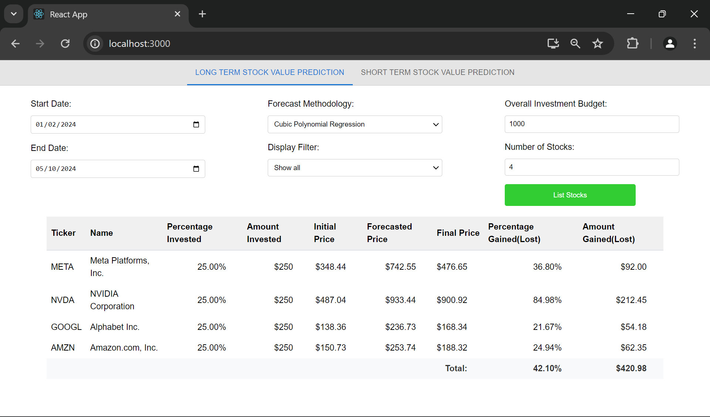

# Quant level

- [Quant level](#quant-level)
  - [Description](#description)
  - [Technologies](#technologies)
  - [Setup instructions](#setup-instructions)
  - [Features](#features)
  - [Roadmap](#roadmap)
    - [Phase 1: v0.1 (Basic app functionality)](#phase-1-v01-basic-app-functionality)
    - [Phase 2: v0.2 (Data analysis)](#phase-2-v02-data-analysis)
    - [Phase 3: v0.3 (Strategy development)](#phase-3-v03-strategy-development)
    - [Phase 4: v0.4 (Risk management)](#phase-4-v04-risk-management)
    - [Phase 5: v1.0 (Additional functionalities - Final version)](#phase-5-v10-additional-functionalities---final-version)

## Description

Quant level is a project that helps with short-term trading and long-term investing.

## Technologies

The project will be built using the following technologies:

- Python, Django(?)
- SQLite(?) or PostgreSQL(?)
- Vue.js(?)

## Setup instructions

1. Clone the repository

2. Install the required dependencies

   - For the backend:
     - Install virtualenv: `pip3 install virtualenv`
     - Create a virtual environment: `python3 -m venv env`
     - Activate the virtual environment:
       - Windows: `env\Scripts\activate`
       - Linux: `source env/bin/activate`
     - Install the required dependencies: `pip install -r requirements.txt`
   - For the frontend:
     - Install Node.js and npm if you haven't already
     - Install the required dependencies: `npm install`

3. Run the application

   - For the backend:
     - Start the Flask server (execute this command in the root directory of the project):
       - Windows: `python src\api.py` or `env\Scripts\python.exe src\api.py`
       - Linux: `python3 src/api.py`
   - For the frontend (execute this command in the root directory of the project):
     - Run the React application:
       - Windows/Linux: `npm run start`

## Features

- Short-term (day trading):
  - Stock price analysis
  - Stock price prediction
  - Market trends prediction
- Long-term (investing):
  - Market trends analysis
  - Market trends prediction
- General
  - Stocks portfolio

NOTE: For long-term investing we should analyze companies, using their financial reports, and predict their stock prices

## Roadmap

### Phase 1: v0.1 (Basic app functionality)

- Price history download: Implement functionality to download historical stock prices from the stock exchange API.
  - We will use the ~~[TradingView](https://www.tradingview.com/) [API](https://www.tradingview.com/rest-api-spec/)~~ (~~optional~~ [Yahoo Finance](https://finance.yahoo.com/) [API](https://developer.yahoo.com/api/)) to download historical stock prices.
    - NOTE: Whichever API we choose, we will need to understand the API's rate limits and data availibility to manage data retrieval efficiently.
- Data preprocessing: Clean and process the downloaded data for further analysis.
  - We will need to handle missing data, outliers, and other data quality issues (formatting issues in the downloaded data).
    - NOTE: Check if TradingView API will provide clean data. If not, we'll create functions and classes specifically for data preprocessing to keep the code clean and maintainable.

### Phase 2: v0.2 (Data analysis)

- Implementation of Basic technical indicators
  - Calculate and display basic technical indicators such as moving averages, RSI (Relative Strength Index), MACD (Moving Average Convergence Divergence), etc.
    - NOTE: We should ensure that our analysis/calculation functions are modular and can be easily extended to incorporate more complex indicators in future phases etc.
- Correlation analysis: Analyze correlations between different stocks and market indices.
  - Use statistical methods (e.g. Pearson correlation coefficient) to analyze the relationship between different stocks and market indices.
    - NOTE: We should consider the scalability of our correlation analysis functions to handle a large number of stocks and indices. Well, maybe for now we should just focus on a few stocks and indices to keep things simple.
    - NOTE: We should also consider the visualization (using heatmaps or something\*) of the correlation analysis results to make it easier for users to interpret the results.

* We can check what Vue.js has to offer for data visualization.

### Phase 3: v0.3 (Strategy development)

- Design a simple trading strategy: Develop a basic trading strategy (e.g. moving average) based on the analyzed data.
  - NOTE: Check out SMA (Simple Moving Average), EMA (Exponential Moving Average) and weighted moving average (WMA) for moving average strategies. Check out njhat moving average crossover is.
- Testing: Test the trading strategy using historical data to evaluate the application's performance.
  - NOTE: We should consider implementing a backtesting framework to evaluate the strategy's historical performance accurately. Check how we can implement this in Python.
  - NOTE: Develope tests for our trading strategy to validate its effectivenes under various market conditions? (optional)

### Phase 4: v0.4 (Risk management)

- Implementation of basic risk management techniques
  - Incorporate risk management principles such as stop-loss orders and position sizing strategies to manage risk effectively.
  - Implement risk-adjusted performance metrics (e.g. Sharpe ratio, Sortino ratio) to evaluate the strategy's risk-adjusted returns.
- Fine-tuning
  - Use optimization techniques (e.g. grid search, genetic algorithms) to fine-tune the trading strategy parameters (automatically?) for better performance.
  - NOTE: (Optional) Conduct sensitivity analysis to evaluate the strategy's performance under different parameter values.

### Phase 5: v1.0 (Additional functionalities - Final version)

- Data streaming and real-time trading simulation
  - NOTE: Maybe use websockets to stream real-time data and simulate trading in real-time?
- User interface enhancement
  - Improve the user interface for better usability and visualization of trading signals.
